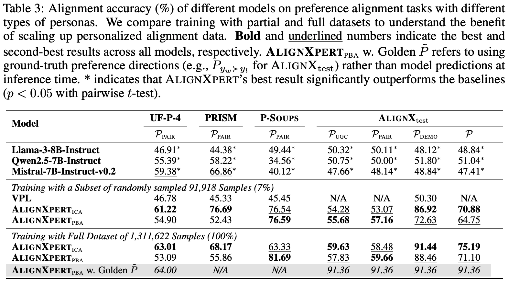

<div align="center">
  <h1 style="font-size: 40px;">AlignX</h1>
  <p>A large-scale dataset of over 1.3 million personalized preference examples</p>
</div>

# Links

- 📜 [Paper](https://arxiv.org/abs/2503.15463)
- 🤗 [AlignX](https://huggingface.co/datasets/JinaLeejnl/AlignX)
- 🤗 [AlignX<sub>test</sub>](https://huggingface.co/datasets/JinaLeejnl/AlignX-test)
- 🤗 [AlignXpert<sub>ICA</sub> (Training with a 7% Subset)](https://huggingface.co/JinaLeejnl/AlignXpert-ICA-Subset)
- 🤗 [AlignXpert<sub>PBA</sub> (Training with a 7% Subset)](https://huggingface.co/JinaLeejnl/AlignXpert-PBA-Subset)
- 🤗 [AlignXpert<sub>ICA</sub> (Training with the Full Dataset)](https://huggingface.co/JinaLeejnl/AlignXpert-ICA-Full)
- 🤗 [AlignXpert<sub>PBA</sub> (Training with the Full Dataset)](https://huggingface.co/JinaLeejnl/AlignXpert-PBA-Full)

# News

- [2025/03/24]: We have published a survey that presents the first comprehensive review of personalized alignment—a paradigm that enables LLMs to adapt their behavior within ethical boundaries based on individual preferences. For more details, see [A Survey on Personalized Alignment -- The Missing Piece for Large Language Models in Real-World Applications](https://arxiv.org/abs/2503.17003).


# Dataset Statistics

The table below summarizes the data sources and statistics for AlignX, involving both large-scale Reddit data and existing alignment datasets to maintain universal value alignment capabilities, with a total of 1,311,622 samples.

| **Source** | **Reddit** | **PKU-SafeRLHF** | **UltraFeedback** | **HelpSteer2** |
|------------|------------|------------------|-------------------|----------------|
| **Dimension** | The 90 self-defined preference dimensions | Safety | Helpfulness / Honesty / Instruction-Following / Truthfulness | Helpfulness / Correctness / Coherence / Complexity / Verbosity |
| **#Examples** | 1,225,988 | 10,714 | 11,629 / 16,809 / 36,169 / 7,219 | 2,255 / 144 / 26 / 33 / 636 |


# Dataset Overview


# Dataset Format

```jsonc
{
    "prompt": "", // the post eliciting responses
    "chosen": "", // the user-preferred response
    "rejected": "", // the less preferred response relative to "chosen"
    "Preference Direction": [0/0.5/1] * 90, // a 90-element list: 1 = "Positive" (higher levels preferred), 0 = "Negative" (lower levels preferred), 0.5 = "Neutral" (no clear preference)
    "Demographic Information": "", // a comprehensive natural language description of the user
    "User-Generated Content": [ // comments written by the same user on other posts
        { // UGC 1
            "prompt": "",
            "comment": "",
            "Preference Direction": [0/0.5/1] * 90
        },
        { // UGC 2
            ...
        },
        { // UGC 3
            ...
        },
        { // UGC 4
            ...
        }
    ],
    "Pair-wise Comparative Feedback": [ // the preference pairs of the same user for comments under other posts
        { // PAIR 1
            "prompt": "",
            "chosen": "",
            "rejected": "",
            "Preference Direction": [0/0.5/1] * 90
        },
        { // PAIR 2
            ...
        },
        { // PAIR 3
            ...
        },
        { // PAIR 4
            ...
        }
    ]
}
```

# AlignXpert

We implement In-Context Alignment (ICA) and Preference-Bridged Alignment (PBA) based on Llama-3.1-8B-Instruct. We train the model using the 7% subset (91,918 samples) and the full dataset (1,311,622 samples), respectively. The experimental results are shown in the table below, where our model significantly outperforms the baselines.



# Evaluation

### Alignment Accuracy

`./eval/loss_ica.py` and `./eval/loss_pba.py` are used to calculate the log probability of chosen and rejected responses with AlignXpert<sub>ICA</sub> and AlignXpert<sub>PBA</sub> as the policy models, respectively. `./eval/loss_few_shot.py` calculates the log probability of chosen and rejected responses for the reference model. After obtaining the log probabilities for both the policy and reference models, `./eval/acc.py` is used to compute the Alignment Accuracy.

### GPT-4 Win Rate

Responses generated by `./eval/gen_ica.py`, `./eval/gen_pba.py`, and `./eval/gen_few_shot.py` are evaluated using GPT-4.
